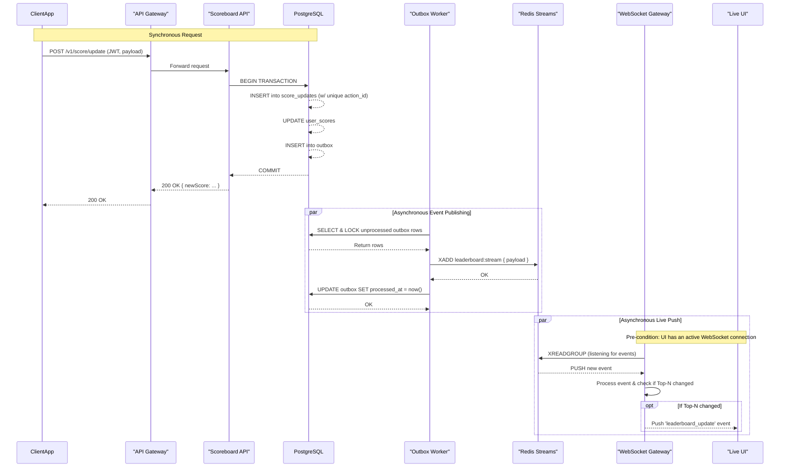

# Scoreboard Service

This document specifies the Scoreboard Service—a backend module that maintains an authoritative scoreboard (Top‑N) with reliable, secure, and live updates to connected clients. This version is designed for high reliability, consistency, and operational maturity by applying the Outbox Pattern, Redis Streams for durable delivery, explicit idempotency rules, and broadcast optimizations.

## Table of contents

1.  [Overview](#1-overview)
2.  [Goals & Non-goals](#2-goals--non-goals)
3.  [High-level architecture](#3-high-level-architecture)
4.  [Core concepts & guarantees](#4-core-concepts--guarantees)
5.  [Data model (SQL)](#5-data-model-sql)
6.  [API surface](#6-api-surface)
7.  [Update pipeline (detailed)](#7-update-pipeline-detailed)
8.  [WebSocket & live pushing rules](#8-websocket--live-pushing-rules)
9.  [Reliability & consistency (Outbox + Streams)](#9-reliability--consistency-outbox--streams)
10. [Idempotency, dedupe and cleanup](#10-idempotency-dedupe-and-cleanup)
11. [Concurrency control](#11-concurrency-control)
12. [Rate limiting & anti-abuse](#12-rate-limiting--anti-abuse)
13. [Observability & monitoring](#13-observability--monitoring)
14. [Testing strategy](#14-testing-strategy)
15. [Deployment & infra notes](#15-deployment--infra-notes)
16. [Failure modes & runbook](#16-failure-modes--runbook)
17. [MVP checklist](#17-mvp-checklist)
18. [Mermaid diagrams](#18-mermaid-diagrams)
19. [Config & operational knobs](#19-config--operational-knobs)
20. [Appendix: Initial Database Schema](#20-appendix-initial-database-schema)

## 1. Overview

The Scoreboard Service accepts score update events, persists them durably, updates a fast leaderboard, and provides real‑time push notifications to subscribed clients. The service is designed with strong reliability guarantees: no published event will be lost once the database transaction commits.

**Key principles:**

- **PostgreSQL is the source of truth** (durable, auditable).
- **Redis Streams** is used for durable event delivery to consumers (WebSocket gateways, analytics).
- **The Outbox Pattern** ensures the database commit and event emission are reliably decoupled.
- **Idempotency** with `actionId` prevents replay/duplicate updates.
- **Broadcasts are optimized** to fire only when the Top‑N list changes or the updated user is within the Top‑N range, reducing client-side noise.

## 2. Goals & Non-goals

### Goals

- Authoritative, low-latency Top‑N leaderboard (default N=10).
- Reliable event propagation to WebSocket gateways (no missed updates after DB commit).
- Protection against unauthorized score tampering and replay attacks.
- Scalable design that can be sharded or partitioned as load grows.

### Non-goals

- Validation of in-app action semantics (we assume the action producer provides attestation if necessary).
- Front-end UI implementation.

## 3. High-level architecture

**Components:**

- **API Gateway / LB:** TLS termination, basic WAF, and global rate limits.
- **Auth Service:** Issues/validates JWTs and provides a JWKS endpoint for key rotation.
- **Scoreboard Service API:** The main application exposing HTTP endpoints for updates and queries.
- **PostgreSQL:** The primary database storing `user_scores`, `score_updates` (audit), `outbox` events, and idempotency constraints.
- **Outbox Worker:** A separate, scalable process that reads from the `outbox` table, publishes events to Redis Streams, and marks them as processed.
- **Redis:** Hosts the `leaderboard:stream` for durable event delivery and an optional `leaderboard:global` sorted set (ZSET) for caching Top-N reads.
- **WebSocket Gateway(s):** Scalable services that consume the Redis Stream via consumer groups, manage client connections, and push updates.
- **Analytics Worker (Optional):** Another consumer of the same stream for metrics, history, etc.

## 4. Core concepts & guarantees

- **Durability Guarantee:** Once `POST /v1/score/update` returns a success (200), the update is persisted and _will eventually be published_ to consumers, even in the event of process crashes.
- **Idempotency:** A client-supplied `actionId` ensures that repeated requests with the same ID will not be processed more than once.
- **Eventual Consistency of Cache:** Any Redis ZSET is treated as a cache of authoritative database values. A periodic reconciliation job can correct any drift.

## 5. Data model (SQL)

Minimal required tables (PostgreSQL). See [Appendix](#20-appendix-sql-migrations) for full scripts.

- **`users`** (Existing)
- **`user_scores`** (Authoritative current score)
  - `user_id` (PK), `score`, `updated_at`, `version` (for optimistic locking).
  - Indexed on `score DESC`.
- **`score_updates`** (Audit trail and idempotency guard)
  - `id`, `user_id`, `score_delta`, `new_score`, `action_id`, `source`, `created_at`.
  - **A `UNIQUE` index on `action_id` (where not null) enforces idempotency at the database level.**
- **`outbox`** (For reliable event emission)
  - `id` (BIGSERIAL), `event_type`, `payload` (JSONB), `created_at`, `processed_at`, `attempts`, `locked_until`.
  - Indexed on `(processed_at, created_at)` for efficient worker polling.

## 6. API surface

All endpoints require TLS. JWT validation must use a JWKS endpoint to support key rotation and enforce `exp`, `nbf`, `iss`, and `aud` claims. A clock skew allowance of ~30s is recommended.

### 1) `POST /v1/score/update`

- **Description:** Submits a score update for a user.
- **Auth:** `Bearer JWT`. For user-originated requests, `sub` must match `userId`. For server-to-server, a specific scope (`score:update`) is required, or mTLS/JWS attestation.
- **Payload:**
  ```json
  {
    "userId": "<uuid>",
    "scoreDelta": 10,
    "actionId": "<string - unique idempotency token>",
    "timestamp": "2025-09-28T06:00:00Z",
    "signature": "<optional signed attestation (JWS)>"
  }
  ```
- **Processing:** Within a single DB transaction:
  1.  Insert into `score_updates`. The unique index on `action_id` will fail if it's a duplicate.
  2.  `UPDATE user_scores SET score = score + $delta ... RETURNING score`.
  3.  `INSERT` into the `outbox` table with the event payload (`userId`, `newScore`).
  4.  Commit the transaction.
- **Responses:**
  - `200 OK { "newScore": 12345 }`: On success or if a duplicate `actionId` is detected (idempotent success).
  - `400 Bad Request`: Invalid payload.
  - `401 Unauthorized`: Auth failure.
  - `429 Too Many Requests`: Rate limit exceeded.

### 2) `GET /v1/leaderboard/top?n=10`

- **Description:** Returns the Top‑N leaderboard. Can be unauthenticated for public boards.
- **Implementation:** Reads from the `leaderboard:global` Redis ZSET for speed. If the cache is cold, it queries PostgreSQL for the top N and populates Redis.
- **Response:**
  ```json
  {
    "top": [{ "rank": 1, "userId": "...", "username": "alice", "score": 12345 }, ...],
    "asOf": "2025-09-28T06:05:00Z"
  }
  ```

### 3) `GET /v1/users/:id/score`

Returns the authoritative score for a user. Reads from Redis with a PostgreSQL fallback.

### 4) `POST /v1/leaderboard/ws-token`

Returns a short-lived WebSocket connection token (JWT with `ws_conn` scope). Requires a valid user JWT to mint.

## 7. Update pipeline (detailed)

1.  **Client** sends `POST /v1/score/update`.
2.  **API Server** validates JWT, rate limits, and payload.
3.  **DB Transaction:**
    - `INSERT` into `score_updates`. If the `action_id` is a duplicate, the transaction fails and the API returns an idempotent `200 OK`.
    - `UPDATE user_scores ... RETURNING new_score`.
    - `INSERT` into `outbox` table with payload `{ userId, newScore, actionId, timestamp }`.
    - **Commit Transaction.** The API now returns `200 OK` to the client.
4.  **Outbox Worker** (asynchronously):
    - Polls the `outbox` table for unprocessed rows.
    - Claims a batch of rows by setting `locked_until`.
    - Publishes each event to the `leaderboard:stream` in Redis using `XADD`.
    - Marks rows as processed by setting `processed_at` on successful publish.
5.  **WebSocket Gateway** (asynchronously):
    - As part of a consumer group, reads new events from `leaderboard:stream`.
    - Processes the event, determines if a broadcast is needed, and pushes a `leaderboard_update` message to relevant clients.

## 8. WebSocket & live pushing rules

- Clients connect to `wss://.../v1/leaderboard/ws` using a short-lived WS token.
- **Broadcast Policy (to reduce noise):**
  1.  Upon consuming an event from the stream, the gateway first updates the authoritative score in the Redis ZSET cache: `ZADD leaderboard:global <newScore> <userId>`.
  2.  It then checks if a broadcast is necessary:
      - Fetch the user's new rank: `ZREVRANK leaderboard:global <userId>`.
      - **Broadcast only if `newRank <= N` OR the user's _previous_ rank was `<= N`.** This ensures updates for users entering, leaving, or moving within the top list are sent.
  3.  If a broadcast is needed, fetch the full Top-N list (`ZREVRANGE`) and push it to subscribed clients.
- **Connection Quality of Service:**
  - **Max Connections:** Limit concurrent connections per user (e.g., 3).
  - **Heartbeat:** Server sends a `ping` every 30s; connection is closed if no `pong` is received within 60s.

## 9. Reliability & consistency (Outbox + Streams)

This architecture decouples the synchronous API response from the asynchronous event publishing, guaranteeing reliability.

- **Why Redis Streams:** Plain Redis Pub/Sub is fire-and-forget. If a consumer is down, messages are lost. Streams provide durability, consumer groups, and message acknowledgements, allowing a restarted gateway to resume where it left off.
- **Why the Outbox Pattern:** It atomically links the state change (score update) and the intent to publish an event within a single database transaction. This solves the dual-write problem where the database commit might succeed but the message broker publish could fail, leading to lost events.
- **Outbox Worker Logic:**
  - The worker polls for rows where `processed_at IS NULL`.
  - It uses a locking mechanism (`locked_until`) to prevent multiple worker instances from processing the same row.
  - It includes a retry mechanism with exponential backoff for publishing to Redis. Failed attempts are tracked in the `attempts` column.

## 10. Idempotency, dedupe and cleanup

- **Mechanism:** The `UNIQUE` index on `score_updates(action_id)` is the primary enforcement mechanism. It is fast and transactionally safe.
- **API Behavior:** If an insert into `score_updates` fails due to the unique constraint, the API should catch this specific database error, query the existing record for the `new_score`, and return a `200 OK` with that data. This makes retries safe and transparent to the client.
- **Cleanup Policy:** The `score_updates` table acts as the idempotency log. It will grow indefinitely. A data retention policy must be established. For example:
  - Rows older than 90 days can be archived to cold storage (e.g., S3).
  - A nightly or weekly job should execute this archival and subsequent deletion.

## 11. Concurrency control

To prevent race conditions where two concurrent updates for the same user result in a "lost update," pessimistic locking should be used within the database transaction.

```sql
-- Inside the transaction, before the UPDATE
SELECT 1 FROM user_scores WHERE user_id = $1 FOR UPDATE;

-- Then perform the update
UPDATE user_scores SET score = score + $delta WHERE user_id = $1;
```

This ensures that concurrent transactions for the same user will execute serially, preserving data integrity.

## 12. Rate limiting & anti-abuse

- **Rate Limiting:** Enforce per-user and per-IP rate limits at the API Gateway or in the service middleware. A Redis-based token bucket or fixed-window counter is recommended (e.g., 10 updates/minute per user).
- **Score Delta Validation:** The `scoreDelta` value must be validated against a configurable range to prevent a user from awarding themselves an impossibly large number of points in a single action.
- **Server-Side Attestation (Recommended):** The most robust anti-cheat mechanism is to have the authoritative service that grants the score (e.g., a game server) generate a signed token (JWS) containing the `userId`, `scoreDelta`, and `actionId`. The Scoreboard Service then verifies this signature using a public key, ensuring the request is legitimate and not forged by a client.

## 13. Observability & monitoring

- **Metrics (The Golden Signals):**
  - **API Service:** Request rate, error rate (4xx/5xx), and latency (p50, p95, p99) for all endpoints.
  - **Outbox Worker:** `outbox_queue_depth` (count of unprocessed rows), `event_publish_latency`, and `publish_error_rate`.
  - **WebSocket Gateway:** Number of active connections, message broadcast rate, and stream consumer lag (how far behind the stream it is).
  - **Database/Redis:** CPU utilization, memory usage, query latency, connection counts.
- **Logging:** Use structured logging (JSON). Every log line must include a `traceId` to correlate a request across all services (API -> DB -> Worker -> Gateway).
- **Alerting:**
  - **High Priority:** Outbox queue depth > 1000 for 5 minutes. WebSocket consumer group lag > 30 seconds. 5xx error rate > 1%.
  - **Medium Priority:** API latency p99 > 500ms. High rate of idempotent request retries.

## 14. Testing strategy

- **Unit Tests (Jest):** Test business logic in isolation (e.g., validation rules, score calculation). Mock all external dependencies (DB, Redis).
- **Integration Tests (Jest + Supertest):** Use Docker Compose to spin up real PostgreSQL and Redis instances.
  - Test that the `POST /v1/score/update` endpoint correctly creates all database records (`user_scores`, `score_updates`, `outbox`).
  - Test the Outbox Worker's ability to read from the DB and publish to a real Redis Stream.
  - Test idempotency by sending the same `actionId` twice and asserting the correct behavior.
- **End-to-End Tests (Cypress/Playwright):**
  - A test script makes an API call to update a score.
  - A separate WebSocket client test connects and listens.
  - The test asserts that the WebSocket client receives the correct `leaderboard_update` message within an acceptable time frame (<1s). This validates the entire system flow.

## 15. Deployment & infra notes

- **Containerization:** All services (API, Worker, Gateway) will be packaged as Docker images.
- **Orchestration (Kubernetes):**
  - **Scoreboard API Service:** Deployed as a `Deployment` with a `HorizontalPodAutoscaler` (HPA) scaling on CPU/memory.
  - **Outbox Worker:** Deployed as a separate `Deployment` with its own HPA, scaling on CPU or custom metrics like queue depth.
  - **WebSocket Gateway:** Deployed as a separate `Deployment`, scaling on active connection count or CPU.
- **Infrastructure as Code (Terraform):** All cloud resources (EKS Cluster, RDS for PostgreSQL, ElastiCache for Redis, ALB) should be managed via IaC.
- **CI/CD:** A pipeline (e.g., GitHub Actions) will automate testing, image building/pushing to ECR, and deployment via a GitOps tool (ArgoCD/Flux).

## 16. Failure modes & runbook

| Scenario                          | Detection                                                                                           | Immediate Action                                                                                 | Prevention / Mitigation                                                                                                         |
| :-------------------------------- | :-------------------------------------------------------------------------------------------------- | :----------------------------------------------------------------------------------------------- | :------------------------------------------------------------------------------------------------------------------------------ |
| **Outbox worker is down/failing** | `outbox_queue_depth` alert fires. No new WebSocket updates are sent.                                | Restart the worker pods. Check logs for poison pill messages or connectivity issues.             | Multiple worker replicas. Dead-letter queue for un-publishable messages. Robust retry logic.                                    |
| **Redis is unavailable**          | API latency spikes (for rate limiting). Worker logs publish errors. Gateway logs connection errors. | Failover to Redis replica. The outbox worker will retry, so no data is lost once Redis recovers. | Use managed Redis with high availability (e.g., AWS ElastiCache Multi-AZ).                                                      |
| **PostgreSQL is unavailable**     | API returns 5xx errors. All components log DB connection errors.                                    | Failover to database replica.                                                                    | Use managed PostgreSQL with high availability (e.g., AWS RDS Multi-AZ).                                                         |
| **WebSocket gateway is down**     | `active_connections` metric drops to zero. Clients cannot connect.                                  | Restart gateway pods. The HPA should automatically launch new ones.                              | Multiple gateway replicas. Clients should have auto-reconnect logic. Redis Streams ensures they get updates after reconnecting. |

## 17. MVP checklist

1.  **DB Schema:** Implement `users`, `user_scores`, `score_updates`, and `outbox` tables with all indexes.
2.  **API Endpoint:** Build `POST /v1/score/update` with JWT auth, validation, and the transactional database logic (including the `outbox` insert).
3.  **Idempotency:** Implement the `UNIQUE` index on `action_id` and the API logic to handle duplicates gracefully.
4.  **Outbox Worker:** Create the worker process that reads from the `outbox`, publishes to Redis Streams, and updates the row.
5.  **WebSocket Gateway:** Build a basic gateway that connects as a stream consumer, manages client connections, and broadcasts every message it receives.
6.  **E2E Test:** Create one automated test that proves the flow from API call to WebSocket message receipt.
7.  **Basic Observability:** Add `traceId` logging and key metrics (`queue_depth`, API latency/errors).
8.  **Refinement (Post-MVP):** Implement the "broadcast only on Top-N change" logic, add `GET` endpoints, and harden security with JWS validation.

## 18. Mermaid diagrams

### Score Update and Asynchronous Push Flow



## 19. Config & operational knobs

The following parameters should be configurable via environment variables or a config service, without requiring a redeployment.

- `LEADERBOARD_TOP_N`: The number of users to track and broadcast (default: 10).
- `SCORE_DELTA_MIN`/`SCORE_DELTA_MAX`: The allowable range for a score update.
- `RATE_LIMIT_POINTS`/`RATE_LIMIT_DURATION`: Parameters for the token bucket algorithm.
- `JWT_JWKS_URL`: The URL for the JSON Web Key Set to validate JWTs.
- `JWT_ISSUER`/`JWT_AUDIENCE`: Required claims for JWT validation.
- `OUTBOX_POLL_INTERVAL`: How often the worker checks for new events (e.g., `200ms`).
- `OUTBOX_BATCH_SIZE`: How many events the worker processes at once (e.g., `100`).
- `WEBSOCKET_PING_INTERVAL`: Interval for sending WebSocket keep-alive pings (e.g., `30s`).

## 20. Appendix: Initial Database Schema

```sql
-- Users
CREATE TABLE IF NOT EXISTS users (
  id UUID PRIMARY KEY,
  username TEXT NOT NULL,
  created_at TIMESTAMPTZ DEFAULT now()
);

-- Authoritative score table
CREATE TABLE IF NOT EXISTS user_scores (
  user_id UUID PRIMARY KEY REFERENCES users(id) ON DELETE CASCADE,
  score BIGINT NOT NULL DEFAULT 0,
  updated_at TIMESTAMPTZ NOT NULL DEFAULT now(),
  version BIGINT NOT NULL DEFAULT 0 -- For optimistic locking
);
CREATE INDEX IF NOT EXISTS idx_user_scores_score ON user_scores (score DESC);

-- Audit and idempotency table
CREATE TABLE IF NOT EXISTS score_updates (
  id UUID PRIMARY KEY DEFAULT gen_random_uuid(),
  user_id UUID NOT NULL REFERENCES users(id),
  score_delta INT NOT NULL,
  new_score BIGINT NOT NULL,
  action_id TEXT,
  source TEXT,
  created_at TIMESTAMPTZ DEFAULT now(),
  signer TEXT
);
CREATE UNIQUE INDEX IF NOT EXISTS idx_score_updates_action_id_unique ON score_updates (action_id) WHERE action_id IS NOT NULL;
CREATE INDEX IF NOT EXISTS idx_score_updates_user_id ON score_updates (user_id);
CREATE INDEX IF NOT EXISTS idx_score_updates_created_at ON score_updates (created_at DESC);

-- Outbox table for reliable event publishing
CREATE TABLE IF NOT EXISTS outbox (
  id BIGSERIAL PRIMARY KEY,
  aggregate_type TEXT NOT NULL,
  aggregate_id UUID,
  event_type TEXT NOT NULL,
  payload JSONB NOT NULL,
  created_at TIMESTAMPTZ DEFAULT now(),
  processed_at TIMESTAMPTZ NULL,
  attempts INT NOT NULL DEFAULT 0,
  locked_until TIMESTAMPTZ NULL
);
CREATE INDEX IF NOT EXISTS idx_outbox_unprocessed ON outbox (processed_at, created_at) WHERE processed_at IS NULL;
```
